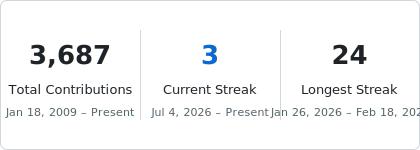

<h1 align="center">Brett Harris</h1>

<strong>Engineering for Good.</strong>

  <a href="https://brettharris.com">brettharris.com</a>
  &nbsp;·&nbsp;
  Virginia, USA
  &nbsp;·&nbsp;
  Building at <a href="https://github.com/cocreatelabs">CO:CREATE</a>

---

## Stack

  
  
  
  
  
  
  

## Stats

  <picture>
    <source media="(prefers-color-scheme: dark)" srcset="assets/langs-dark.svg" />
    
  </picture>
  &nbsp;
  <picture>
    <source media="(prefers-color-scheme: dark)" srcset="assets/streak-dark.svg" />
    
  </picture>

Most of my commits live in private repos these days — the graph undersells the mileage.

Cards generated in-repo by <a href=".github/workflows/stats.yml">a weekly GitHub Action</a> — no third-party stats service to go down.

