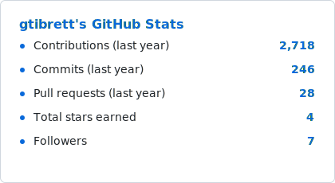
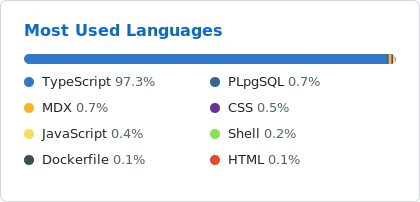

<h1 align="center">Hi, I'm Brett 👋</h1>

<strong>Engineering for Good.</strong>

  <a href="https://brettharris.com">brettharris.com</a>
  &nbsp;·&nbsp;
  Virginia, USA
  &nbsp;·&nbsp;
  Building at <a href="https://github.com/cocreatelabs">@cocreatelabs</a>

---

## About

I'm a front-end-leaning full-stack engineer who cares about the craft of user interfaces — the kind that are fast, accessible, and quietly get out of the user's way. Most of my work lives in the React + TypeScript ecosystem, with a soft spot for design systems and data visualization.

- 🛠️ Currently building at [CoCreate Labs](https://github.com/cocreatelabs)
- 🎨 Big believer in UX as an engineering discipline, not an afterthought
- 📊 If there's data, I will find a way to chart it
- 🏎️ Formula 1 fan — which explains the repo below

## Stack

  
  
  
  
  
  
  

## Things I've Built

| Project | What it is |
| --- | --- |
| 🏁 [**effone-hub**](https://github.com/gtibrett/effone-hub) | A Formula One data viewer — seasons, drivers, constructors, and circuits rendered as interactive dashboards. React, Material UI, and Nivo charts. |
| 🧩 [**mui-additions**](https://github.com/gtibrett/mui-additions) | Common functionality and components layered on top of Material UI. |
| 🚀 [**jira-launcher**](https://github.com/gtibrett/jira-launcher) | A Chrome extension for jumping straight to Jira tickets. |

I also keep forks of the tools I lean on — [Nivo](https://github.com/gtibrett/nivo), [MUI](https://github.com/gtibrett/material-ui), [Font Awesome](https://github.com/gtibrett/Font-Awesome) — for digging into internals and the occasional patch.

## Stats

  <picture>
    <source media="(prefers-color-scheme: dark)" srcset="assets/stats-dark.svg" />
    
  </picture>
  &nbsp;
  <picture>
    <source media="(prefers-color-scheme: dark)" srcset="assets/langs-dark.svg" />
    
  </picture>

Cards refresh weekly via <a href=".github/workflows/stats.yml">a GitHub Action</a> in this repo — no third-party stats service to go down.

Most of my commits live in private repos these days — the graph undersells the mileage. 🏎️💨

